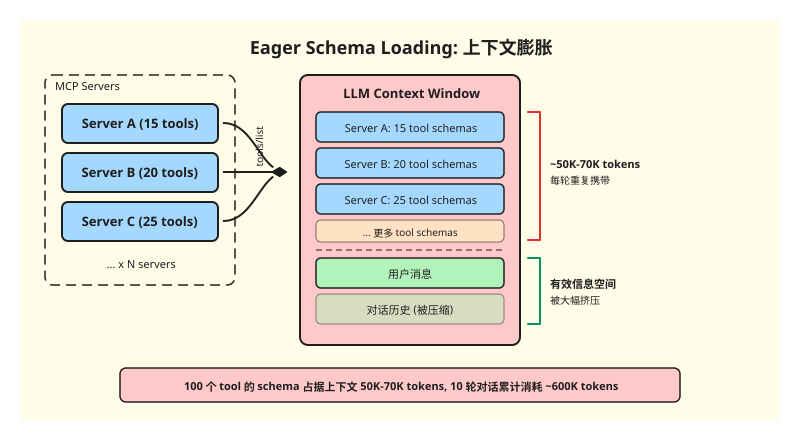
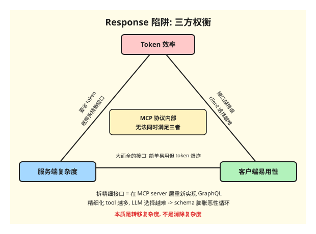
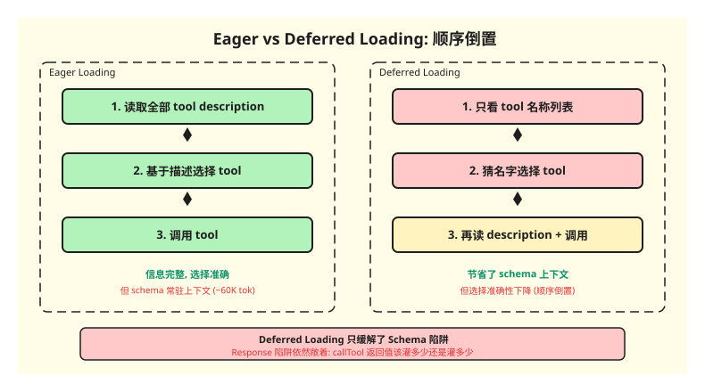
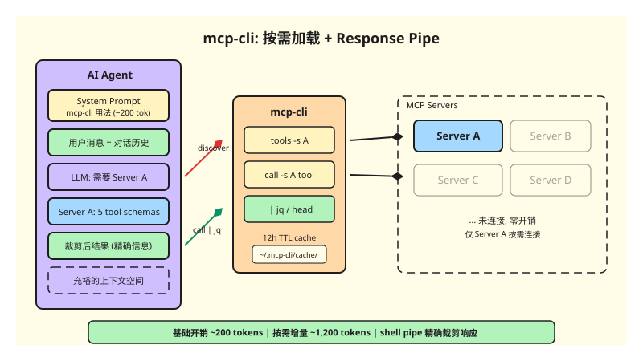
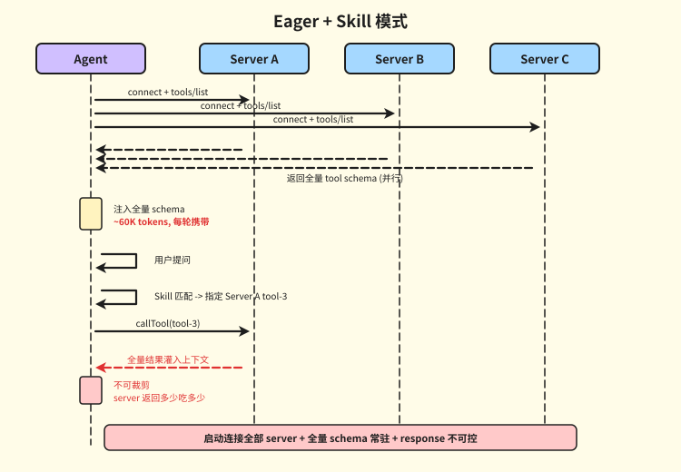
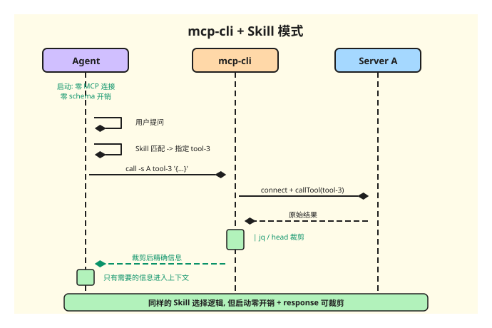
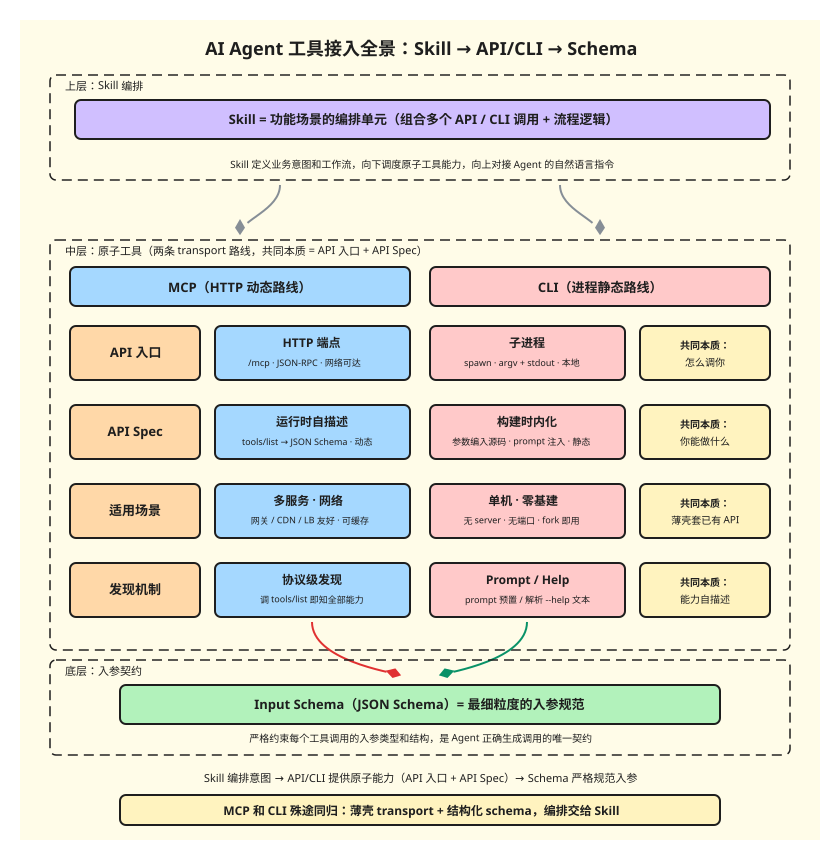

## 1. MCP 的愿景：动态工具发现

在[上一篇文章](/post/2025-06-17-ai-and-mcp)中我们聊了 MCP 是什么以及它为什么强大。简单回顾：MCP 通过标准化协议让大模型可以在运行时发现和调用外部工具，从而获得与现实世界交互的能力。

这个设计有一个非常漂亮的愿景：**动态工具发现**。agent 启动后连接到多个 MCP server，拉取所有工具的 schema（名称、描述、输入参数定义），将这些信息注入 LLM 上下文。LLM 根据用户请求和这些 schema 自主判断该用哪个工具、提取参数、发起调用。整个过程不需要人来硬编码"遇到什么问题用什么工具"，工具选择完全由模型动态决策。

这个愿景成立的前提是：**LLM 能在有限的上下文窗口内，对所有可用工具做出有效选择**。

然而当你真正开始用起来，接入的 server 和 tool 越来越多的时候，这个前提就开始崩了。

## 2. 现实：两个上下文陷阱

这不是一个假设性的问题。在大型企业里，员工日常工作涉及的系统少则几十多则上百——OA、CRM、财务、代码仓库、监控、工单、文档、日程、审批……AI 提效的第一步前提就是把这些系统的能力作为 AI 可调用的接口暴露出来，而 MCP 恰好是一个非常好的落地方式：每个系统提供一个 MCP server，将自身能力封装成标准化的 tool。

但这也意味着一件事：**tool 的数量增长不是线性的，而是随着企业 AI 落地的深入而加速膨胀的**。我们内部目前已经有上千个 tool，这个数字还在持续增长。Uber 也公开分享过类似的现状：他们通过统一网关接入了超过 1,000 个 MCP server，仅安装 100 多个 tool 的场景下，schema 预加载就给初始 prompt 带来了约 50K-70K token 的开销，并且**每一轮上下文都要重复携带**。

这就是 MCP 最初愿景撞墙的真实规模。

当前主流 MCP client（Claude Desktop、Cursor、Cline 等）采用的是 **Eager Schema Loading** 模式：启动时连接所有已配置的 server，拉取全量 tool schema 注入 LLM 上下文。



这带来了两个陷阱。

### Schema 陷阱

前面提到的 Uber 数据已经很说明问题：100 多个 tool 就带来了 50K-70K token 的常驻开销。而且这不是一次性成本——**每一轮推理都要重复携带这些定义**。一个 10 轮对话，仅 tool schema 的累计开销就能达到 500K-700K token，但整个过程可能只用到了其中 3 个 tool。

更关键的是，大量 tool 定义会显著干扰模型的选择精度。200 个工具摆在面前，模型更容易产生幻觉或者"炫技"——想方设法去调用某个看起来相关但其实不该用的工具。这也是我在上一篇文章中提到的：你开启的工具本身就是带有信息量的输入，工具越多噪声越大。

### Response 陷阱

`callTool` 的返回值直接灌入上下文。server 返回多少 token，agent 就要吃多少。agent 对 server 的响应体积没有任何控制权。

如果你用过 github-mcp 之类的服务就会有体感：一个 list issues 调用可能返回几千行 JSON，绝大部分都是你不需要的字段。但在 Eager 模式下，这些数据全部进入上下文，没有任何裁剪机会。

这里存在一个三方权衡：**服务端复杂度、客户端易用性、token 效率**。如果要在 MCP 层解决 response 膨胀问题，服务端就必须把大而全的接口拆分成精细化的小接口——按场景过滤数据、按需裁剪字段，本质上是在 MCP server 层重新实现一套类似 GraphQL 的查询能力。这无疑极大增加了服务端的开发和维护成本。

而且这对 client 端同样是负担：原本一个 tool 能搞定的事，现在被拆成了多个精细化 tool，agent 需要根据不同场景选择正确的那个。选错了——比如用了一个只返回摘要的 tool 但其实需要全量数据——任务就会因为信息不足而失败。精细化的 tool 越多，LLM 的选择难度越大，和前面说的 schema 膨胀问题又形成了恶性循环。

所以在 MCP 协议层内部解决 response 问题，本质上是把复杂度从"上下文膨胀"转移到了"服务端实现"和"客户端选择"上，并没有真正消除它。



## 3. Deferred Loading：不得不做的工程补丁

面对 schema 膨胀，业界目前的应对方式是 **deferred loading**（延迟加载）。思路很直觉：不在启动时加载全量 schema，而是只给 LLM 暴露工具的名称列表，等 LLM 判断需要某个工具时再去拉取完整 schema。

但这个补丁有一个结构性的问题：它把"**先读 description 再选工具**"的顺序倒置成了"**先猜名字选工具再读 description**"。工具选择的准确性天然下降，因为模型能依赖的信息从完整的描述退化成了一个名字。



这甚至已经不是一个可以权衡的选择了——在工具数量足够多的场景下，**你只能选择 deferred loading 来保上下文，而不是准确性**。上下文不够你什么都做不了，准确性不够你至少还能跑起来。

所以 MCP 的现状是：原本的"动态工具发现"愿景在 token 经济的约束下被迫妥协，**MCP 退化成了一个轻量级的工具调用协议层**。工具发现和选择的问题，交给了上层的编排逻辑（比如 Skill）来解决。

而且值得注意的是，deferred loading 只缓解了 schema 陷阱，**对 response 陷阱完全无能为力**。无论你是 eager 加载还是 deferred 加载 tool schema，`callTool` 的返回值该灌多少进上下文还是灌多少。前面分析的三方权衡——服务端要拆精细化接口、client 要精确选择——在 deferred loading 下一个都没变。schema 的问题靠延迟加载勉强兜住了，response 的问题依然敞着口。

换句话说，MCP 协议内部能做的优化已经到头了。要同时解决这两个陷阱，需要跳出协议本身，在一个新的层面上想办法。

## 4. 一种务实的解法：mcp-cli

理解了问题之后，解法的方向就比较清晰了：既然把所有 tool schema 塞进上下文不现实，那就别塞。让 agent 按需去发现和调用工具。

mcp-cli 就是基于这个思路做的一个轻量 CLI 工具。核心思想很简单：**把 MCP 的工具发现和调用包装成 shell 命令，agent 把它当成一个普通的命令行工具使用**。




### Load on Demand

传统 Eager 模式下，agent 启动时就要连接所有 server 并注入全量 tool schema。mcp-cli 的做法是：agent 启动时零 MCP 连接，系统 prompt 只注入 mcp-cli 的用法说明（大约 200 token）。当 agent 判断需要某个 server 的能力时，再通过命令按需拉取：

```bash
# 按需发现：只在需要时才拉取某个 server 的工具列表
mcp-cli tools -s analytics

# 按需调用：确定工具后发起调用
mcp-cli call -s analytics query_logs '{"days":7}'
```

基础上下文开销从 O(S x T)（server 数 x tool 数）降到 O(1)。新增 server 不会线性膨胀上下文，agent 只看到当前真正需要的工具列表，选择精度也更高。

同时 mcp-cli 在本地维护了一层 12 小时 TTL 的 tool schema 缓存，基于文件 mtime 判断过期。缓存命中时零网络开销，过期后自动刷新。这让"按需"不意味着"每次都慢"。

用 Uber 的真实数据做个对比：100 个 tool、10 轮对话。

Eager 模式：~60K token 常驻 schema 开销，10 轮累计 ~600K token 仅用于重复携带 tool 定义。

mcp-cli：基础 ~200 token，实际涉及 2 个 server、5 个 tool 时，增量开销约 1,200 token，且只出现在需要的轮次。

### Response Pipe

这是 mcp-cli 最关键的设计。`call` 命令的输出是标准 shell stdout，天然支持管道裁剪：

```bash
# 只取前 20 行，大结果集不会撑爆上下文
mcp-cli call -s analytics query_logs '{"days":7}' | head -20

# jq 精确提取字段，丢弃所有冗余结构
mcp-cli call -s db get_users '{}' --json | jq '.[].name'

# 先 wc -l 探规模，再决定是否读全文
mcp-cli call -s logs search '{"keyword":"error"}' | wc -l

# grep 过滤，只把匹配行带入上下文
mcp-cli call -s config dump '{}' | grep -i "database"
```

这意味着 **agent 不再依赖 MCP server 本身有多高效**。server 返回冗余数据？`jq` 裁剪。结果集太大？`head` 分步探索。只关心某个字段？一条管道搞定。

上下文 token 由 agent 主动控制，而不是被动接受 server 给多少吃多少。你不需要每个 MCP server 都精心优化返回体积，shell 管道就是最后一道过滤。

### 实际场景下的时序

前面分别介绍了 Load on Demand 和 Response Pipe 的机制。在真实的企业级场景下，工具选择往往不是由 LLM 面对上百个 tool 自主判断的——规模化之后，Skill 或 Prompt 会精确指定该用哪个 tool（第 6 节会详细讨论这个演变）。也就是说两种模式下 tool 选择的逻辑是一样的，差异在启动开销和 response 控制上。下面是一个更贴近实际的时序对比。







两边都是 Skill 精确指定 tool，工具选择逻辑完全一样。区别在于：Eager 模式下 agent 启动时连接了所有 server、注入了全量 schema（绝大部分用不到），而且 callTool 的返回值全量灌入上下文不可裁剪；mcp-cli 模式下启动零开销，按需连接目标 server，response 经 shell pipe 裁剪后才进入上下文。

## 5. 适用场景

两种模式不是互斥的。

| 场景 | 推荐 | 理由 |
|------|------|------|
| server 少（1-3），tool < 20 | Eager | schema 开销可控，调用延迟最低 |
| server 多（5+），tool > 50 | mcp-cli | schema 节省显著，避免 tool 选择干扰 |
| 长对话（20+ 轮） | mcp-cli | schema token 累积效应明显 |
| server 返回大/冗余数据 | mcp-cli | pipe 裁剪，不依赖 server 效率 |
| 高频调用同一 tool | Eager | 避免反复 connect/close 的 RTT |
| server 不稳定 | mcp-cli | 故障隔离，不阻塞启动 |

实际上 agent 可以对高频核心 server 做 eager loading，对低频、tool 数量大、或返回数据不可控的 server 走 mcp-cli，混合使用。

## 6. 工具发现 vs 工具编排

回到更根本的问题：MCP 的困境不只是一个工程优化问题，它反映了"**工具发现**"和"**工具编排**"是两件不同的事。

MCP 最初试图用一个协议同时解决两个问题：让 agent 发现有哪些工具可用（工具发现），同时让 agent 自主决定用哪些工具、怎么组合（工具编排）。当工具少的时候这两件事可以合在一起做，schema 塞进上下文就行。但工具一多，上下文装不下了，两件事就必须拆开。



最终的分层是：

- **工具层（MCP）解决：** 具体的工具如何使用，服务端的 input spec 是什么。本质是**服务端能力的 API spec + 调用协议**。
- **编排层（Skill/Prompt）解决：** 如何选择工具和编排工具。基于对场景的理解，将工具组合成解决特定问题的流程。

MCP 相当于断尾求生，退化到了工具调用协议层——这不是退步，而是找到了自己正确的位置。工具 spec 的维护和分发正是 MCP 协议天然包含的能力，这件事它做得很好。至于"面对一个问题该用哪些工具、按什么顺序"，这是编排层的事，不该由一个协议来承担。

这个分层不是理论推演，而是已经在发生的事。在真实的企业级场景下，当 tool 数量到了上千的规模，叠加 deferred loading 之后，**LLM 早已不是工具选择的决策者了**。实际的决策链是：用户触发一个特定场景，agent 匹配到对应的 Skill，Skill 精确指定该用哪个 server 的哪个 tool、参数怎么填、结果怎么处理。LLM 的角色从"面对上百个 tool 自主选择"变成了"按 Skill 指令执行"——这正是编排层在做的事。

越来越多的平台级 MCP server 也意识到了这一点，开始官方提供配套的 Skill。飞书的 lark-cli 就是一个典型例子：它不只是一个 MCP server，同时提供了一整套 lark-* Skill（lark-doc、lark-sheets、lark-calendar 等），每个 Skill 针对一个具体场景，内部精确指定该调用哪些 tool、以什么顺序、怎么处理返回值。agent 不需要从几百个飞书 API 里自己挑，Skill 已经替它做好了编排。

mcp-cli 的价值也正是在这个分层下体现的：它让工具调用层保持轻量和按需，把上下文空间留给真正需要的信息——无论是工具的 schema，还是用户的对话内容。

## 7. 一些思考

写完这些，有几个感受。

第一，**token 经济决定了架构**。在传统软件中，内存和带宽的开销往往可以忽略不计，所以 eager loading 是默认选择——简单、低延迟、好理解。但在 LLM 的世界里，上下文窗口是最昂贵的资源，每多占 1k token 就意味着少一些有效信息的空间。这从根本上改变了系统设计的权衡——按需加载从"优化"变成了"必要"。

第二，**Unix 哲学在 AI 时代找到了新的用武之地**。mcp-cli 的 Response Pipe 本质上就是 Unix 管道哲学的延伸：每个程序做好一件事，通过管道组合。MCP server 负责调用，`jq`/`head`/`grep` 负责裁剪，agent 负责决策。这套组合在 AI agent 的场景下出奇地好用，因为 agent 天然就是一个"能写 shell 命令的用户"。

第三，**好的协议知道自己的边界**。MCP 退化到工具调用层不是失败，是成熟。一个协议试图做太多事情，最终什么都做不好。认清自己的位置，把工具发现和编排交给上层，反而让整个生态更健康。
